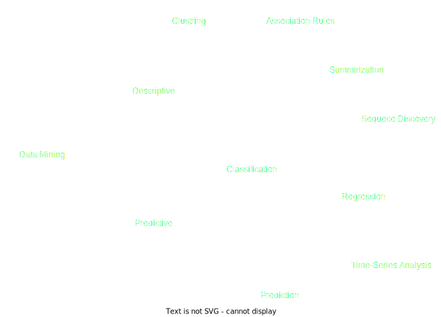

### Table of Contents
1. [Data Processing](#data-processing)
2. [Data Mining](#data-mining)
3. [Data Distribution](#data-distribution)
4. [Data Preprocessing](#data-preprocessing)

## **Data Processing** :
Data Processing is the task of converting data from a given form to a much more usable and desired form i.e. making it more meaningful and informative. The output of this complete process can be in any desired form like graphs, videos, charts, tables, images, and many more, depending on the task we are performing and the requirements of the machine. Can be divided in the following steps:

1. Collection.
The most crucial step when starting with ML is to have data of good quality and accuracy, high-quality and accurate data will make the learning process of the model easier and better and at the time of testing, the model would yield state-of-the-art results. 

2. Preparation.
The collected data can be in a raw form which can’t be directly fed to the machine. So, this is a process of collecting datasets from different sources, analyzing these datasets and then constructing a new dataset for further processing and exploration. 

3. Input. 
Now the prepared data can be in the form that may not be machine-readable, so to convert this data to the readable form, some conversion algorithms are needed.

4. Processing. 
This is the stage where algorithms and ML techniques are required to perform the instructions provided over a large volume of data with accuracy and optimal computation.

5. Output.
In this stage, results are procured by the machine in a meaningful manner which can be inferred easily by the user. Output can be in the form of reports, graphs, videos, etc

6. Storage. 
This is the final step in which the obtained output and the data model data and all the useful information are saved for future use.
----

## **Data Mining** :  
The action of process data to gain patterns, and to gain knowledge on that pattern. In the process of data mining, large data sets are first sorted, then patterns are identified and relationships are established to perform data analysis and solve problems.

* Data Mining is divided in some areas:

  
  

----

## **Data Distribution** :

Normal distribution:  
In probability theory, normal or Gaussian distribution is a continuous probability distribution that is symmetric about the mean, showing that data near the mean are more frequent in occurrence than data far from the mean. 

- Normal distributions used in statistics and are often used to represent real-valued random variables.  
  
- has two parameters: &mu; the mean, wich is the central tendency of the distribution, and &sigma; the standard deviation that is a measure of variability. It defines the width of the normal distribution.
  
- The standard deviation determines how far away from the mean the values tend to fall. It represents the typical distance between the observations and the average.
----

## **Data Preprocessing** :

For achieving better results from the applied model in Machine Learning projects the format of the data has to be in a proper manner. 

Another aspect is that the data set should be formatted in such a way that more than one Machine Learning and Deep Learning algorithm are executed in one data set, and best out of them is chosen.

1. Rescale Data  
   When our data is comprised of attributes with varying scales, many machine learning algorithms can benefit from rescaling the attributes to all have the same scale.

   This is useful for optimization algorithms used in the core of machine learning algorithms like gradient descent.

   It is also useful for algorithms that weight inputs like regression and neural networks and algorithms that use distance measures like K-Nearest Neighbors.

2. Binarize Data  
   We can transform our data using a binary threshold. All values above the threshold are marked 1 and all equal to or below are marked as 0.
   
   It can be useful when you have probabilities that you want to make crisp values. It is also useful when feature engineering and you want to add new features that indicate something meaningful.

3. Standardize Data  
   Standardization is a useful technique to transform attributes with a Gaussian distribution and differing means and standard deviations to a standard Gaussian distribution with a mean of 0 and a standard deviation of 1.
