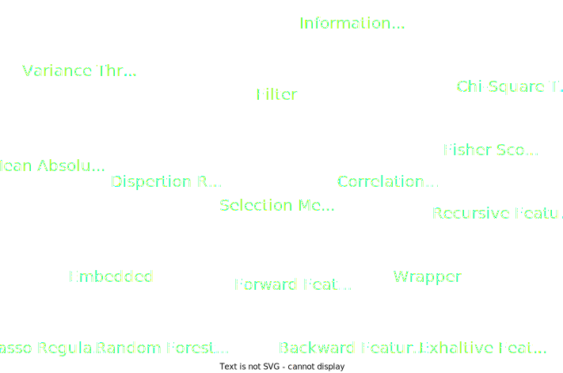

# Analysis Data Step

## Feature Selection

The careful selection of optimal features for your model. While the specific technique may vary, the primary objective remains consistent: identify the features that exert a greater influence on your model’s performance. Those techniques can be broadly categorized into the following groups:
  - Supervised Techniques: These methods are applicable to labeled data and help identify pertinent features to enhance the performance of supervised models such as classification and regression. Examples include linear regression, decision trees, and SVM.
  - Unsupervised Techniques: These methods are suitable for unlabeled data. Examples include K-Means Clustering, Principal Component Analysis, and Hierarchical Clustering.

## Feature selection methods:

1. Filter methods identify the inherent characteristics of features through univariate statistics rather than relying on cross-validation performance. They are quicker and less computationally intensive compared to wrapper methods. When working with high-dimensional data, filter methods are a more computationally efficient choice.

2. Wrapper methods necessitate a mechanism to explore the entire array of potential feature subsets, evaluating their efficacy through training and assessing a classifier with that particular subset of features. This approach hinges on a specific machine learning algorithm tailored to the dataset at hand. It involves an exhaustive search, assessing all feasible feature combinations against the evaluation criterion. Typically, wrapper methods yield superior predictive accuracy compared to filter methods.

3. Embedded methods combine the advantages of both wrapper and filter methods by considering feature interactions while still keeping computational costs manageable. These methods operate iteratively, managing each iteration of the model training process and selectively extracting features that significantly contribute to training for a given iteration.

  

