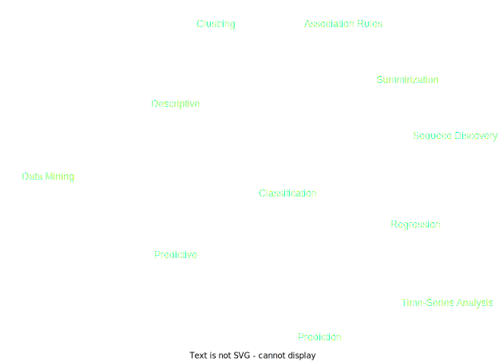
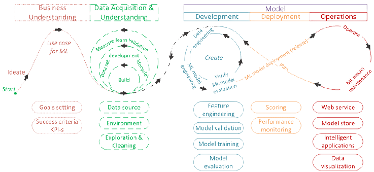
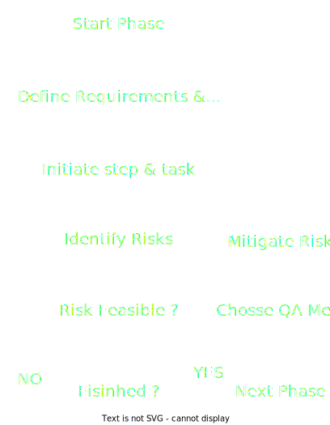

# Life Cycle of a Data Science Project

see:
- [**CRISP-DM**](#)
- [**CRISP-ML(Q)**](#crisp-mlq)

 

# 
 CRISP-DM 

Following the CRISP-DM (Cross Industry Standard Process for Data Mining) framework, that consists of a set of good practices (aka methodology) to execute a project in Data Science.

The CRISP-DM methodology consists of six main phases:

1. ## Business Understanding:
    This initial phase involves understanding the project objectives, requirements, and business goals. It aims to clarify the specific problems that need to be solved and how data mining can contribute to achieving those goals.

2. ## Data Understanding:
    now, data scientists gather and explore the available data to gain insights into its structure, quality, and potential usefulness for the project. This step helps in identifying data issues and deciding which data is relevant for the analysis.

3. ## Data Preparation:
    This phase focuses on data cleaning, transformation, and integration. Data scientists perform tasks like handling missing values, encoding categorical variables, and creating derived features to ensure that the data is ready for modeling.

4. ## Modeling:
    The modeling phase is where data scientists apply various data mining techniques to build and evaluate predictive or descriptive models. Different algorithms are tested and tuned to identify the most suitable one for the problem at hand.

5. ## Evaluation:
    here, the performance of the models is assessed using validation techniques such as cross-validation or hold-out samples. The goal is to select the best-performing model that meets the project's requirements.

6. ## Deployment:
    The final phase involves deploying the chosen model into the production environment, making it available for end-users to make predictions or decisions. It also includes documenting the process and results to facilitate future maintenance and improvements.

The CRISP-DM metodology is focused on Data Mining projects

## **Data Mining** :  
The action of process data to gain patterns, and to gain knowledge on that pattern. In the process of data mining, large data sets are first sorted, then patterns are identified and relationships are established to perform data analysis and solve problems.

* Data Mining is divided in some areas:

  
  

 

# 
 CRISP-ML(Q)

for the specific development of machine learning applications, an evolution of the methodology was made, the CRISP-ML(Q) framework. Stands for Cross Industry Standard Process for Machine Learning with Quality assurance. 

  

CRISP-ML(Q) is implemented with 6 stages as follows:

1. ## Business and Data Understanding
    The applications starts with identifying the scope of the ML application, the success criteria, a data quality verification and the feasibility of the project before setting him up. Defining clear and measurable Key Performance Indicators (KPI) is required.

    - A helpful approach is to define a non-ML heuristic benchmark to communicate the impact of machine learning tasks with the business stakeholders.

    - Applying the Machine Learning Canvas framework would be a structured way to perform this task.
   
    Therefore, one crucial requirement is the documentation of the statistical properties of data and the data generating process. Similarly, data requirements should be stated and documented as well.

2. ## Data Preparation
    The Data Engineering phase, here, data selection, data cleaning, feature engineering, and data standardization tasks are performed.

    We identify valuable and necessary features that do satisfy data quality requirements for future model training by using either filter methods, wrapper methods, or embedded methods for data selection. 
      
      - At this point, we also might tackle the problem of unbalanced classes by applying over-sampling or under-sampling strategies.

      - Add unit testing for data cleaning to mitigate the risk of error propagation to the next phase. 
      
      - Depending on the machine learning task, we might need to perform feature engineering and data augmentation activities. 

      - the normalization task will mitigate the risk of bias to features on larger scales. 

3. ## Model Building and Tuning
    The Model Engineering. Generally, the modeling phase includes model selection, specialization and training tasks. Additionally, depending on the application, we might use a pre-trained model, compress the model, or apply ensemble learning methods.

    Ensure that the method and the results of the modeling phase are reproducible by collecting the model training method’s metadata, like: algorithm, training, validation and testing data set, hyper-parameters, and runtime environment description. The result reproducibility assumes the validation of the model’s mean performance on different random seeds. A helpful framework here is the “Model Cards Toolkit”.

    Finally, we package the ML workflow in a pipeline to create repeatable model training during the modeling phase.

4. ## Evaluation
   
5. Model Deployment
6. Monitoring and Maintenance 

And for each phase the quality assurance approach in CRISP-ML(Q) requires the definition of requirements and constraints, instantiation of the specific tasks, specification of risks that might negatively impact the efficiency and success of the ML application, quality assurance methods to mitigate risks when these risks need to be diminished. As Following:

  

