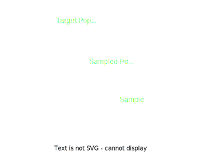

## 
**Statistics**

Statistics is the branch of mathematics that deals with the collection and study of numerical data also a collection of such numerical data, it can be devided in 2 branches:

**<u>Descriptive</u>**: the branch that gathers, sorts, summarizes, and displays the data. Uses tables, graphs, media to representate the data. 

**<u>Inferential</u>**: the branch that involves using Descriptive to estimate population parameters. Means running a formal test for a difference between two groups and comparing them to what's expected on a theoretical or empirical distribution.

----
### <u> **Data Classification:** </u>
Data can be divided on some forms, qualitative or quantitative, discrete or continuous and etc. Here some forms of classfication and mensurement:

* Classification:
   - Qualitative - or categorical, consist of labels or descriptions of traits.
     - Discrete - data that can take on only particular values and ate usually counts.
     - Continuous - data that can take on any value in a given interval, are usually mensurement.
   - Quantitative - or numerical, consist of count or measurements.

* Mesurement:
   - Nominal - Descriptions, clasifieds by name, tags or qualities.
   - Ordinal - Orderings, diferences of entrys are irrelevant.
   - Interval - differences between levels, organizables, zero does not imply null.
   - Ratio - zero = null, similar to the previous one, proportions can be made between the values.
  
Some properties of those mesurements:

|          | Categorizing | Ordering | subtraction | multiplicity |
| -------- | :----------: | :------: | :---------: | :----------: |
| Nominal  |      ✓       |    ✗     |      ✗      |      ✗       |
| Ordinal  |      ✓       |    ✓     |      ✗      |      ✗       |
| Interval |      ✓       |    ✓     |      ✓      |      ✗       |
| Ratio    |      ✓       |    ✓     |      ✓      |      ✓       |
----

### <u>The process of a Statistical study</u>:
 

  

1. Determine the desing of the study.
   1. State the question to be studied.
   2. Determine the population and variables.
   3. Determine the sampling method.
2. Collect the Data.
3. Organize the Data.
4. Analyze the Data.
----

## 
Glossary

1. _'Target Population'_: a particular group of interest.
   1. _'sampled population'_: is a group from which the sample is taken.
   2. _'sampling frame'_: is a physical list of all members of the sampled population.
   3. _'sample'_: is a subset of the population from which data are colected.
2. _'Census'_: is a study in which data are obtained from every member of the population.
3. _'Variable'_: is a value or characteristic that changes among members of the population.
4. _'Data'_: are the counts, measurements, or observations gathered about a specific variable in a population in order to study it.
5. _'Parameter'_: is a numerical description of a population characteristic.
6. _'Statistic'_: is a numerical description of sample characteristics.
