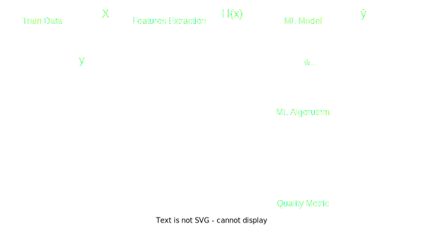

# 
 Classification:
Generalizing, in machine learning and statistics, classification is a supervised learning approach in which the computer program learns from the data given to it and makes new observations or classifications, is the process of finding a model that describes and distinguishes data classes and concepts.  

  

Where:
- X: pre-classified data, in the form of an N*M matrix. N is the no. of observations and M is the number of features
- y: An N-d vector corresponding to predicted classes for each of the N observations.
- Feature Extraction: Extracting valuable information from input X using a series of transforms.
- ML Model: The “Classifier” we’ll train.
- ŷ: Labels predicted by the Classifier.
- Quality Metric: Metric used for measuring the performance of the model.
- ML Algorithm: The algorithm that is used to update weights ŵ, which updates the model and “learns” iteratively. 

_**Types of Classification**_ :

1. Binary: When we have to categorize given data into 2 distinct classes, also called as Simple.
2. Multiclass: The number of classes is N, wherm N $ \gt $ 2.
3. Discriminative: determines just one class for each row of data. It tries to model just by depending on the observed data, depends heavily on the quality of data rather than on distributions. Example: Logistic Regression 
4. Generative: Models the distribution of individual classes and tries to learn the model that generates the data behind the scenes by estimating assumptions and distributions of the model. Used to predict the unseen data. Example: Naive Bayes Classifier 

There are various types of classifiers. Some of them are : 

- Linear Classifiers: Logistic Regression
- Tree-Based Classifiers: Decision Tree Classifier
- Support Vector Machines
- Artificial Neural Networks
- Bayesian Regression
- Gaussian Naive Bayes Classifiers
- Stochastic Gradient Descent (SGD) Classifier
- Ensemble Methods: Random Forests, AdaBoost, Bagging Classifier, Voting Classifier,  ExtraTrees Classifier
----

### **Simple Classification** :    
Here we have an categorical or qualitative variable as response. The outcome depends upon : 
1. How well these features are able to “map” to the outcome.
2. The quality of our data set. By quality, I refer to statistical and Mathematical qualities.
3. How well our Classifier generalizes this relationship between the features and the outcome.
4. The values of the x1 and x2.

_**[Logistic Regression](https://en.wikipedia.org/wiki/Logistic_regression)**_ 

Determines the probability of an observation to be part of a class or not. Formally, in binary logistic regression there is a single binary dependent variable, coded by an indicator variable, where the two values are labeled "0" and "1", while the independent variables can each be a binary variable (two classes, coded by an indicator variable) or a continuous variable (any real value).

- The function that converts log-odds to probability is the logistic function, hence the name. The unit of measurement for the log-odds scale is called a logit, from logistic unit. 

- Logistic Function:
    $$
    f(x) = \frac{L}{1+e^{-k(x-x_{0})}}, 
    $$
  where:
  - $ x_{0} $ the x value of the sigmoid's midpoint
  - L, the supremum of the values of the function
  - k, the logistic growth rate or steepness of the curve   
     
Binary variables can be generalized to categorical variables when there are more than two possible values, and the binary logistic regression generalized to multinomial logistic regression. If the multiple categories are ordered, one can use the ordinal logistic regression

- Analogous linear models for binary variables with a different sigmoid function instead of the logistic function (to convert the linear combination to a probability) can also be used, most notably the probit model

- Sigmoid Function:
$$
    S(x)=\frac{1}{1+e^{-x}}=\frac{e^{x}}{e^{x}+1}=1-S(-x)
$$
- For Logit: 
$$
    p(x)=\frac{e^{\beta_{0}+\beta_{1}X}}{1+e^{\beta_{0}+\beta_{1}X}}
$$(1)
$$
    \frac{p(x)}{1-p(x)}=e^{\beta_{0}+\beta_{1}X}
$$(2)
$$
    log(\frac{p(x)}{1-p(x)})=\beta_{0}+\beta_{1}X
$$(3)
- now it's linear with respect to x and the probability is bound to 0 and 1. And we always can expand the formula to accommodate multiple predictors, to get better results.
$$
    log(\frac{p(x)}{1-p(x)})=\beta_{0}+\beta_{1}X_{1}+\beta_{2}X_{2}+...+\beta_{p}X_{p}
$$

Some Considerations of Logistic Regression:
- when classes are well separated, paramenters of logistic regression are unstable.
- unstable for small datasets.
- not the best method to predict more than 2 classes.

_**[Linear discriminant analysis](https://en.wikipedia.org/wiki/Linear_discriminant_analysis)**_

A method used to find a linear combination of features that characterizes or separates two or more classes. The resulting combination may be used as a linear classifier, or, more commonly, for dimensionality reduction before later classification.

- models the distribution of predictors separately for each class and uses the Bayes' theorem to estimate the probability, that describes the probability of an event, based on prior knowledge of conditions that might be related to the event. Bayes' for classification:
$$
    Pr(Y=k|X=x)=\frac{\pi_{k}f_{k}(x)}{\sum^{K}_{l=1}\pi_{l}f_{l}(x)}
$$
Where:
- K is the number of classes, usually K ≥ 2.
- $ \pi_{k} $ is the overall probability that an observation is associated to the $ k^{th} $ class
- $ f_{k}(x) $ is the desity function of x for an observation that comes from the $ k^{th} $ class.
- this means that k of x is larger if the probability that an observation form the $ k^{th} $ class has capital X equals x

For the density function, assuming only one predictor and normal distribution, we have the normal distribution function:
$$
    f_{k}(x)=\frac{1}{\sqrt{2\pi\sigma_{k}}}exp(-\frac{1}{2\sigma^{2}(x-\mu_{k})^{2}})
$$
For the discriminant: $\delta_{k}(x)$
$$
\delta_{k}(x)=x\frac{\mu_{k}}{\sigma^{2}}-\frac{\mu^2_{k}}{2\sigma^{2}}+log(\pi_k)
$$

Assumptions of LDA (one predictor):
- Each class is drawn from a Gaussian distribution and has its own mean.
- Assume a common variance for all classes.

Assumptions of LDA (more than one predictor):
- Each class is drawn from a multivariate Gaussian distribution and has its own mean vector.
- Assume a common covariance matrix for all classes.

Two criteria are used by LDA to create a new axis: 
1. Maximize the distance between means of the two classes.
2. Minimize the variation within each class.

### **Multiple Class Classification** :

_**Decision tree classifier**_ – A decision tree classifier is a systematic approach for multiclass classification. It poses a set of questions to the dataset (related to its attributes/features). The decision tree classification algorithm can be visualized on a binary tree. On the root and each of the internal nodes, a question is posed and the data on that node is further split into separate records that have different characteristics. The leaves of the tree refer to the classes in which the dataset is split.

_**Support vector machine classifier**_ – SVM is an efficient classification method when the feature vector is high dimensional. 

_**k-nearest neighbors classifier**_ – KNN is the simplest classification algorithm. This classification algorithm does not depend on the structure of the data. Whenever a new example is encountered, its k nearest neighbors from the training data are examined. Distance between two examples can be the euclidean distance between their feature vectors. The majority class among the k nearest neighbors is taken to be the class for the encountered example. 

_**Naive Bayes classifier**_ – Based on Bayes’ theorem. It is termed as ‘Naive’ because it assumes independence between every pair of features in the data. Let (x1, x2, …, xn) be a feature vector and y be the class label corresponding to this feature vector.